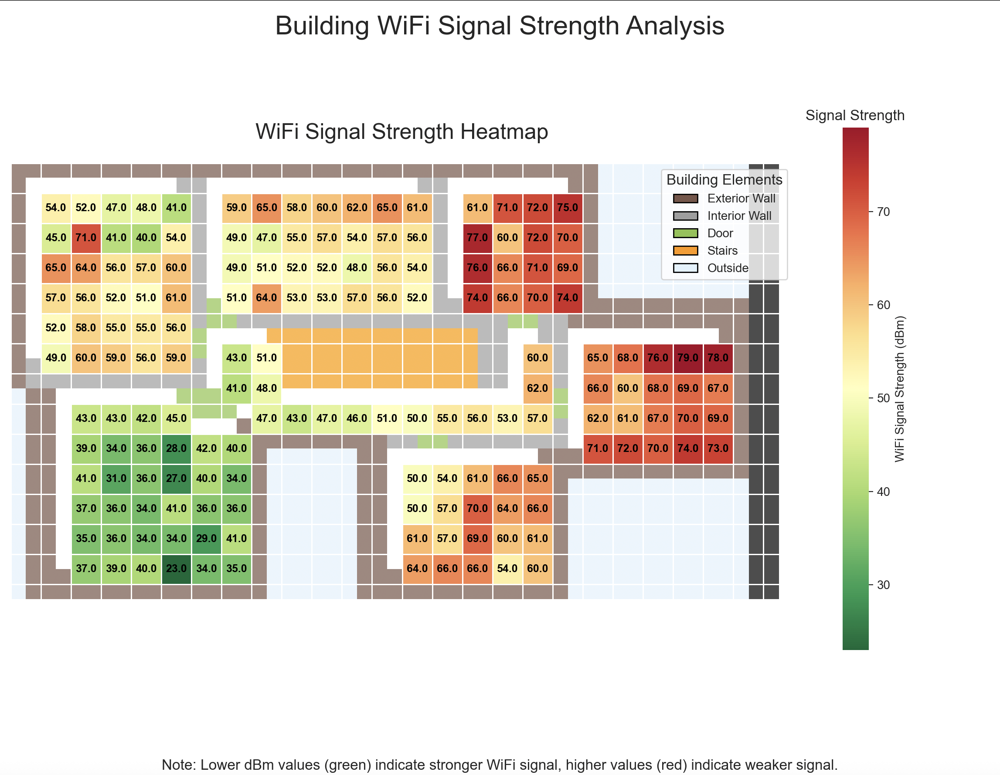

# WiFi Signal Strength Mapping

A project to visualize WiFi signal strength throughout a building using Python data visualization tools.

## Project Overview

This project maps WiFi signal strength (measured in dBm) across a building floorplan to identify areas with strong and weak connectivity. The visualization helps identify signal dead zones and optimal router placement.

## Tools & Technologies

- **Python**: Core programming language
- **NumPy**: For efficient array operations and data manipulation
- **Matplotlib**: For creating the visualization framework and overlays
- **Seaborn**: For generating the heatmap visualization
- **Pandas**: For data organization 

## Methods

### Floorplan Creation
The building layout was manually encoded as a 2D matrix with specific numeric values representing:
- Open spaces (996)
- Doors (997)
- Interior walls (998)
- Exterior walls (999)
- Outside areas (1000)
- Stairs (1002)

### Signal Strength Collection
Signal strength was measured in dBm (decibel-milliwatts) at various points throughout the building:
- Lower negative values (e.g., -40 dBm) indicate stronger signals
- Higher negative values (e.g., -80 dBm) indicate weaker signals
- Data points were collected manually using a WiFi analyzer app - this took forever

### Visualization Process
1. Created a base floorplan matrix to represent the building structure
2. Populated signal strength data in corresponding locations
3. Applied a diverging color map (red-yellow-green) where:
   - Green areas indicate stronger signal
   - Red areas indicate weaker signal
4. Overlaid structural elements (walls, doors, stairs) on the heatmap
5. Added annotations showing exact dBm readings at each measurement point

## Key Findings

The visualization reveals:
- Signal strength patterns throughout the building
- Areas with optimal connectivity (greener areas)
- Potential WiFi dead zones (redder areas) on the right side of the building away from router room
- How building features like walls impact signal propagation

## Future Improvements

- Implement automated data collection methods
- Compare signal strength across different frequencies (2.4GHz vs 5GHz)
- Add multiple access point analysis
- Create 3D visualization to account for multi-floor effects

## License

[MIT](LICENSE)
